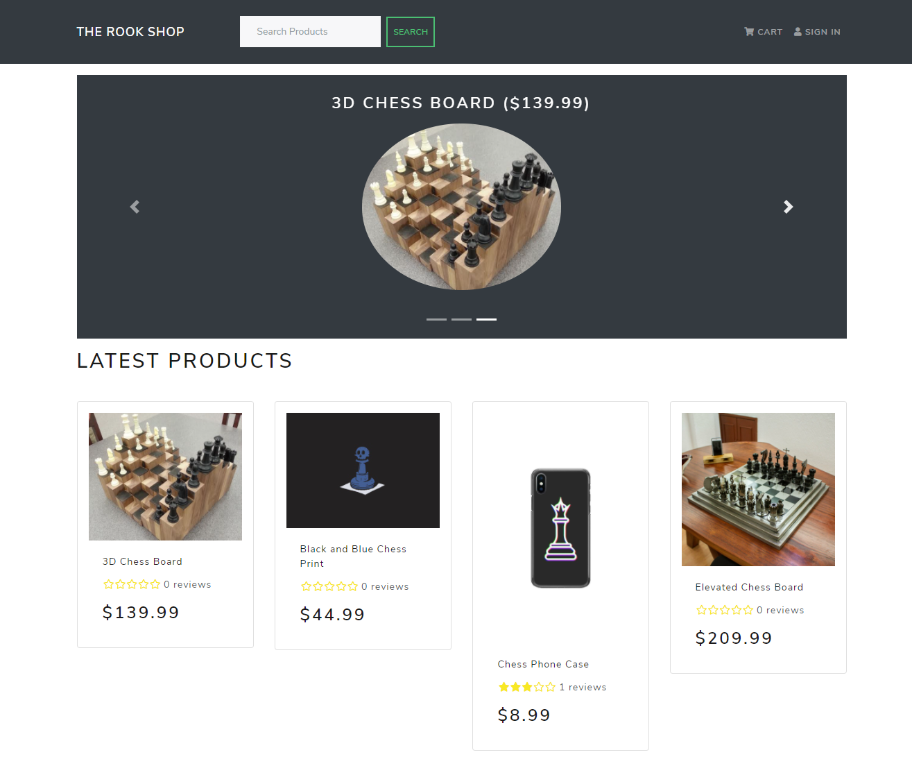
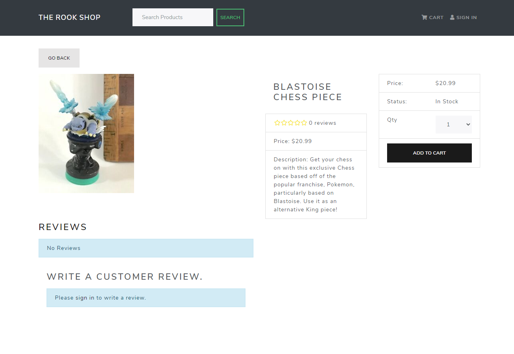

# [The Rook Shop](https://therookshop.herokuapp.com/ "The Rook Shop")

## Description
A full-stack E-Commerce web application made with **MongoDB, Express.js, React/Redux, Node.js** or the **MERN** stack. This web app is complete with **User Authentication and Authorization** thanks to [JSON Web Tokens (JWT)](https://jwt.io/ "JWT") and keeps track of Users, Products, Orders. It utilizes the [PayPal API](https://developer.paypal.com/docs/api/overview/ "PayPal Developer Docs") for customer payment information and checkout. It also uses React Bootstrap for creating re-usable React components to use throughout the app. I built the backend API that returns Products, Users, and Orders using [Postman](https://www.postman.com/ "Postman").

## Installation
1. Make sure you have the Node Package manager (NPM) and git installed
2. In your terminal, enter "git clone https://github.com/dogurasu/The-Rook-Shop.git" if you have a registered SSH key or "git clone https://github.com/dogurasu/The-Rook-Shop.git" if you do not
3. Change directories into your newly cloned repository with "cd ./The-Rook-Shop"
4. Make sure to install all dependencies in the 'frontend', 'backend', and the root directories with: "cd frontend" and "npm install ." and "cd backend" and "npm install ."
5. This app uses a PayPal API, a MongoDB cluster, and JSON Web Tokens so you need to make sure to go and sign up for a PayPal API key, register for a MongoDB cluster, and put them in a ".env" file
6. Add additional variables like "NODE_ENV" and "PORT" and set them to "development" and "3000" respectively.
7. Finally, run "npm run start" in the "backend" directory and "npm run start" in the "frontend" directory in a separate terminal. Your web application should be up and running on something like "localhost:3000"

## Contributing:
Don't hesitate to open a Pull Request if you see anything you think can be approved!

## License
MIT License

Copyright (c) 2020 Douglas Park

Permission is hereby granted, free of charge, to any person obtaining a copy
of this software and associated documentation files (the "Software"), to deal
in the Software without restriction, including without limitation the rights
to use, copy, modify, merge, publish, distribute, sublicense, and/or sell
copies of the Software, and to permit persons to whom the Software is
furnished to do so, subject to the following conditions:

The above copyright notice and this permission notice shall be included in all
copies or substantial portions of the Software.

THE SOFTWARE IS PROVIDED "AS IS", WITHOUT WARRANTY OF ANY KIND, EXPRESS OR
IMPLIED, INCLUDING BUT NOT LIMITED TO THE WARRANTIES OF MERCHANTABILITY,
FITNESS FOR A PARTICULAR PURPOSE AND NONINFRINGEMENT. IN NO EVENT SHALL THE
AUTHORS OR COPYRIGHT HOLDERS BE LIABLE FOR ANY CLAIM, DAMAGES OR OTHER
LIABILITY, WHETHER IN AN ACTION OF CONTRACT, TORT OR OTHERWISE, ARISING FROM,
OUT OF OR IN CONNECTION WITH THE SOFTWARE OR THE USE OR OTHER DEALINGS IN THE
SOFTWARE.
